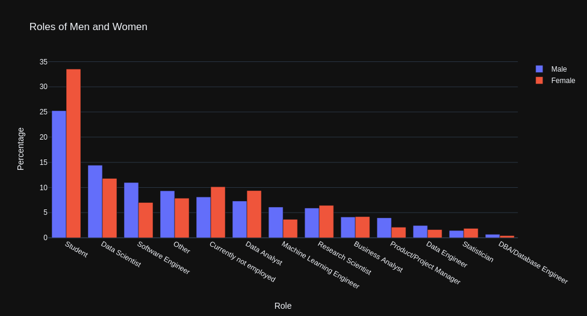
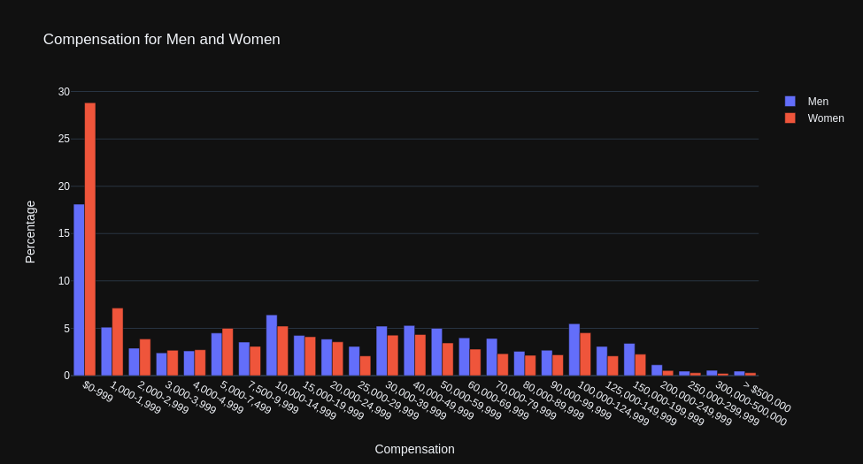
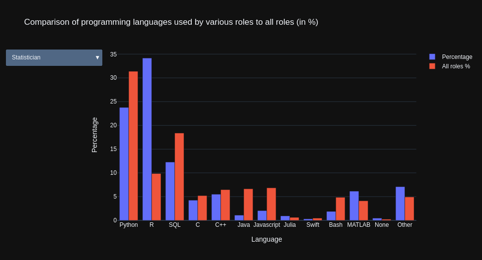

# Intro

I decided to dive into data visualization using plotly. I could use plotly express and graph objects for plotting few graphs with the data.

# Key Observations

1. The gender gap within survey population is evident. There is a humongous difference in both roles and compensation for women

2. Large percentage of women are students. This shows that the gender gap will be closed in future if the trend continues

3. Statisticians used R more than Python. 34% of statisticians use R compared to 9% average in the sample

# Screenshots

# Data source

[2020 Kaggle Machine Learning & Data Science Survey](https://www.kaggle.com/c/kaggle-survey-2020)

